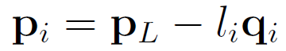
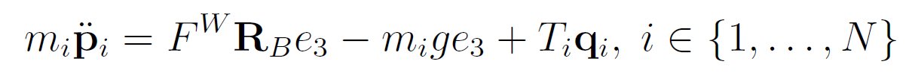
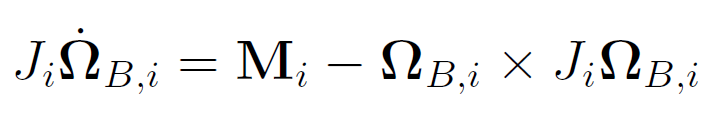
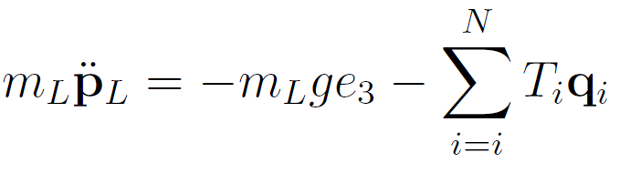
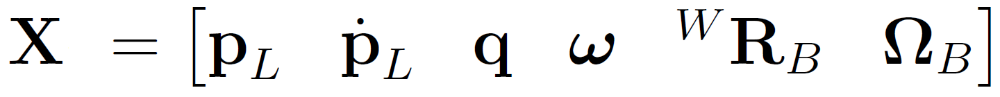
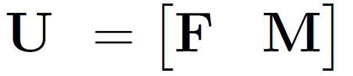
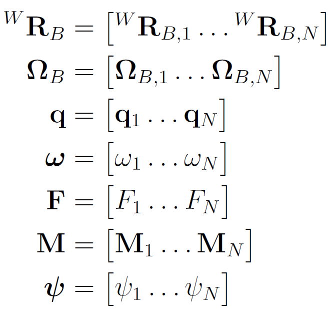
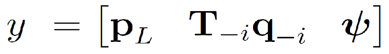
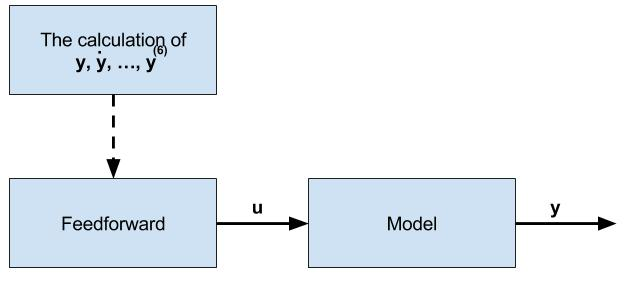
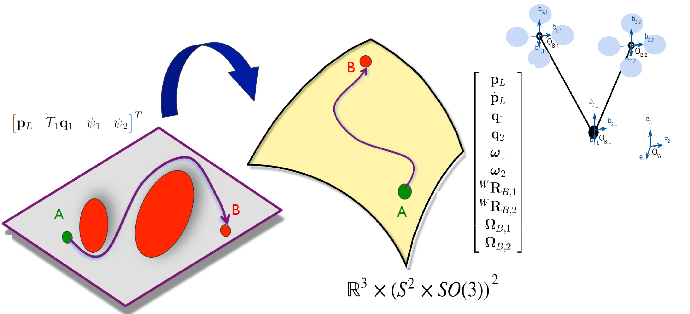

# Project: Cooperative Load Transport with group of Quadrotors

Overview
--
We address the problem of cooperative transportation of a cable-suspended payload by multiple quadrotors. This work based on the work which is maded by Kumar and Sreenath [1](http://www.kumarrobotics.org/wp-content/uploads/2014/01/p11.pdf). In the beginning, we determine the equations describing the dynamics of the system. Then we define the differentiall flatness of a dynamic system and determine the flat output vector of our system.  Finally we write a program with matlab to implement the motion of N quadrotors with a mass point. 

Dynamic Model of a Group of Quadrotors with a Mass Punkt Load
--

Three quadrotors transport a mass point load.

First we define the used notations:

| The used Symbols                      | Definition               | 
| ---------------------------- :   |-------------------------- | 
| $ N \in\mathbb{Z}^+ $            | The number of Quadrotors  |  
| $ \mathbf{p}_L \in\mathbb{R}^3 $ | Position vector of the center of  load in the inertial frame| 
| $ \mathbf{p}_i \in\mathbb{R}^3 $ | Position vector of the center of mass of the load in the inertial frame     |
| $ m_L\in\mathbb{R}^+ $           | Mass of  load            | 
| $ \mathbf{\Omega}_i \in\mathbb{R}^3  $   | Mass of  $ i^{th} $  quadrotor,  i ∈{1,…,N}     | 
| $ \mathbf{q}_i \in\mathbb{S}^2 $         | Unit vector from the $ i^{th} $ quadrotor to the load in body-fixed frame of the load     | 
| $ {l}_i \in\mathbb{R}^+ $         | Length of the cable between the ith quadrotor and the load |
| $ m_i \in\mathbb{R}^+ $          | Mass of  $ i^{th} $  quadrotor,  i ∈{1,…,N}     | 
| $ F_i \in\mathbb{R}^+ $          | Force produced by th $ i^{th} $  quadrotor,  i ∈{1,…,N}     | 
| $ T_i \in\mathbb{R}^+ $          | Tension in the $ i^{th} $ cable  i ∈{1,…,N}     | 
| $ \mathbf{M}_i \in\mathbb{R}^3 $          | Moment produced by th  $ i^{th} $  quadrotor,  i ∈{1,…,N}     | 
| $ ^WR_{B,i} \in{SO}(3) $    |  The rotation matrix of the $ i^{th} $ quadrotor from the body-fixed frame to the inertial frame      | 

The $ i^{th} $ quadrotor flies in 3-D Space. To describe its motion we need six paramters, three to describe the position and three to describe its orientation. On the other hand the mass point load doesn't have orientation that is why only three paramenters is needed to describe its motion. The configuration space of the system is given by $ Q = \mathbb{R}^3 \times(S^2 \times SO(3))^N $ and the position of the $ i^{th} $ quadrotor given by the following kinematic relation,

According to [1](http://www.kumarrobotics.org/wp-content/uploads/2014/01/p11.pdf) the Euler dynamics of the $ N $ quadrotors and the load can be easily written down as follows:  
First the translational motion of $ i^{th} $ quadrotor: 

the rotational motion of $ i^{th} $ quadrotor:  

finally the translational motion of the point mass load:

We can put these equations in the form $ \dot{\mathbf{x}} = \mathbf{f} (\mathbf{x}, \mathbf{u}) $ with state vector $ \mathbf{x} \in \mathbb{R}^n $
 
and the input vector $ \mathbf{u} \in \mathbb{R}^m $
 
where:
 

Differential Flatness
--
First we define which does Differential Flatness mean, then we want to explain why do we use this property to control our system.  
Let us start with the definition, according to [2](http://www-personal.acfr.usyd.edu.au/spns/cdm/papers/Mellinger.pdf): The states and the inputs differentially flat system can be written as algebraic functions of carefully selected flat outputs and their derivatives. This facilitates the automated generation of trajectories since any smooth trajectory (with reasonably bounded derivatives) in the space of flat outputs can be followed by our system. Our choice of flat outputs is given by:
 
where:
 
Assuming that there is no effect of disturbance in the system, we can use feedforward to control our system, i.e., the input vector can be determined from the desired output vector, and then we use it to control the group of Quadrotors with the mass point load.

 

In [3] the case of 2 Quadrotors was considered. After the Determination of the state vector as function of the flat output the input vector was found.    
 

References
--
[1]: K. Sreenath and V. Kumar. Dynamics, Control and Planning for Cooperative Manipulation of Payloads Suspended by Cables from Multiple Quadrotor Robots, 2013,  http://www.kumarrobotics.org/wp-content/uploads/2014/01/p11.pdf  
[2]: D. Mellinger and V. Kumar. Minimum Snap Trajectory Generation and Control for Quadrotors,http://www-personal.acfr.usyd.edu.au/spns/cdm/papers/Mellinger.pdf  
[3]: M.K. Daaboul. Kooperative Regelung von Quadrokoptern bei Berücksichtigung von Hindernissen und Kopplung,2017,

